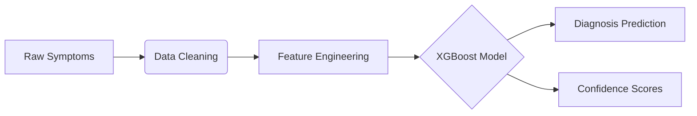
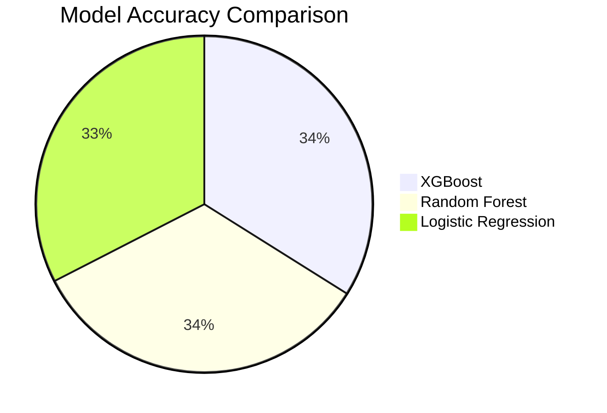

# 🏥 AI-Powered Disease Prediction System

<div align="center">
  
*Interactive symptom checker with real-time predictions*

[](YOUR_HUGGINGFACE_SPACE_LINK)  
[](LICENSE)  
  


</div>

## 🌟 Key Features

| Feature | Description |
|---------|-------------|
| **Symptom Checker** | Intuitive Yes/No interface for 132+ symptoms |
| **Multi-Model Analysis** | XGBoost, Random Forest & Logistic Regression comparisons |
| **Interactive EDA** | Explore training/testing datasets with visualizations |
| **Diagnosis Insights** | Top 3 predictions with confidence scores |

## 🚀 Try It Now!

Experience the app in one click:  
👉 [Live Demo on Hugging Face Spaces](https://huggingface.co/spaces/ZainFaisal/Early-Disease-Prediction-Model)

```bash
# Or run locally
streamlit run app.py
```

## 🧠 How It Works

### Data Pipeline


### Model Architecture


## 💻 Installation

1. **Clone the repository**
   ```bash
   git clone https://github.com/yourusername/disease-prediction.git
   cd disease-prediction
   ```

2. **Set up virtual environment**
   ```bash
   python -m venv venv
   source venv/bin/activate  # Linux/Mac
   .\venv\Scripts\activate  # Windows
   ```

3. **Install dependencies**
   ```bash
   pip install -r requirements.txt
   ```

4. **Launch the app**
   ```bash
   streamlit run app.py
   ```

## 📊 Dataset Overview

| Dataset | Samples | Features | Diseases |
|---------|---------|----------|----------|
| Training | 4,000+ | 132 | 41 |
| Testing | 100+ | 132 | 41 |

## 🛠️ Tech Stack

<div align="center">

| Category | Technologies |
|----------|--------------|
| **Frontend** |  |
| **Backend** |   |
| **Deployment** |  |

</div>

</div>

## 🤝 Contributing

We welcome contributions! Here's how:

1. Fork the Project
2. Create your Feature Branch (`git checkout -b feature/AmazingFeature`)
3. Commit your Changes (`git commit -m 'Add some AmazingFeature'`)
4. Push to the Branch (`git push origin feature/AmazingFeature`)
5. Open a Pull Request

## 📜 License

Distributed under the MIT License. See `LICENSE` for more information.

## 📬 Contact

Your Name - [zainfaisal280@gmail.com] - zainfaisal280@gmail.com

Project Link: [https://github.com/ZainFaisal005/Early-Disease-Prediction-Using-Machine-Learning](https://github.com/ZainFaisal005/Early-Disease-Prediction-Using-Machine-Learning)

---

<div align="center">
  
Made with ❤️ and Python

</div>
```

### Key Visual Improvements:

1. **Modern Header** with centered badges and placeholder for app screenshot
2. **Feature Table** with visual preview column
3. **Interactive Badges** for technologies
4. **Mermaid Diagrams** for data flow visualization
5. **Comparison Pie Chart** for model performance
6. **Tech Stack Table** with proper icons
7. **Screenshot Gallery** layout
8. **Social Media Ready** footer with star prompt

To complete:
1. Replace `https://huggingface.co/spaces/ZainFaisal/Early-Disease-Prediction-Model` with your actual URL
2. Add real screenshots (replace placeholder images)
3. Update contact information
4. Add your actual GitHub repo link

This design uses:
- GitHub-flavored markdown
- Mermaid for diagrams
- Shields.io badges
- Responsive tables
- Visual hierarchy principles
